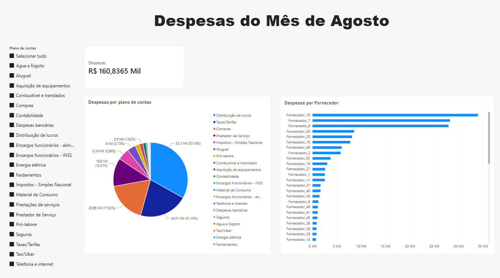
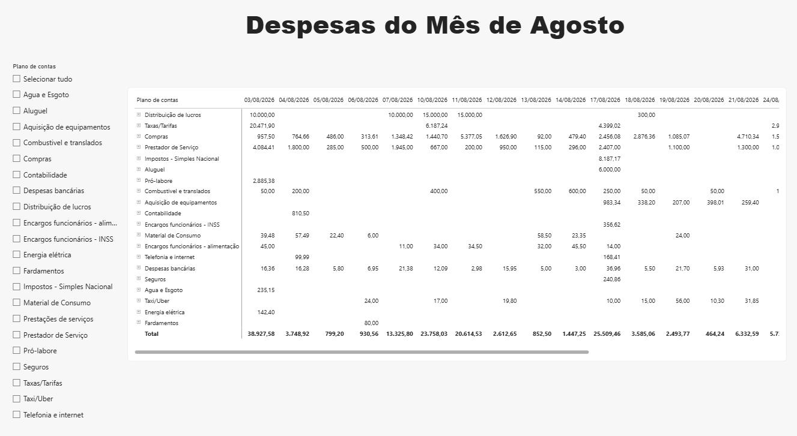
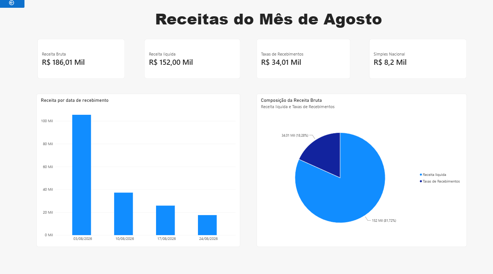
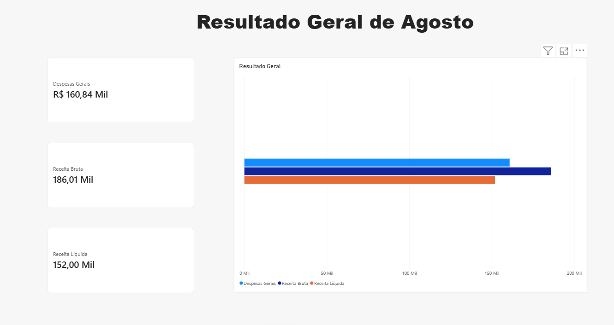

# Análise de Dados Financeiros

Exploração, tratamento e visualização de movimentações financeiras com Python e Power BI.

## Sobre o projeto

Este projeto apresenta uma análise das movimentações financeiras de uma empresa durante o mês de agosto, aqui denominada **Empresa Confidencial**.

Para preservar a confidencialidade das informações, os nomes dos fornecedores e clientes presentes nos dados foram anonimizados antes da utilização no projeto.

A análise foi desenvolvida utilizando Python para o tratamento, exploração e visualização dos dados, e Power BI para a construção de um dashboard interativo.

## Objetivo

O objetivo do projeto é analisar as movimentações financeiras do mês de agosto, identificando e classificando as despesas de acordo com o plano de contas e os fornecedores, além de analisar os recebimentos, as taxas incidentes sobre as movimentações e o resultado financeiro do período.

A análise busca compreender o comportamento das entradas e saídas financeiras e verificar se o mês apresentou resultado positivo ou negativo.

## Tecnologias utilizadas

* Python
* Pandas
* Matplotlib
* Seaborn
* Power BI
* DAX

## Etapas do projeto

### 1. Tratamento dos dados

Os dados foram inicialmente tratados com Python, incluindo:

* limpeza das informações;
* conversão dos valores financeiros para formato numérico;
* tratamento das datas;
* identificação de entradas e saídas;
* organização das movimentações para análise.

### 2. Análise com Python

Após o tratamento, foram realizadas análises das movimentações financeiras considerando:

* despesas por plano de contas;
* despesas por fornecedor;
* evolução dos gastos ao longo do mês;
* recebimentos por plano de contas;
* recebimentos por fornecedor;
* evolução dos recebimentos;
* receita bruta e receita líquida;
* taxas e tarifas;
* resultado financeiro do período.

As visualizações foram desenvolvidas utilizando **Matplotlib** e **Seaborn**.

### 3. Dashboard com Power BI

Os dados tratados foram utilizados na construção de um dashboard interativo no Power BI.

Foram utilizados recursos como:

* cartões de indicadores;
* gráficos de barras;
* gráficos de linhas;
* gráficos de composição;
* segmentações de dados;
* matriz hierárquica;
* medidas DAX;
* filtros e interação entre os visuais.

## Principais análises

A análise permitiu identificar as principais despesas da Empresa Confidencial por plano de contas e fornecedor, além do comportamento dos gastos ao longo do mês.

Também foi possível analisar os recebimentos, identificar as taxas cobradas sobre as movimentações e calcular a receita líquida e o resultado financeiro do período.

Ao final do mês de agosto, o resultado financeiro analisado foi **positivo**.

## Dashboard

O projeto conta com um dashboard interativo desenvolvido no Power BI, permitindo explorar as movimentações financeiras por diferentes dimensões.

As imagens das páginas do dashboard estão disponíveis na pasta `power_bi_imagens/`.

O arquivo `.pbix` utilizado na construção do dashboard está disponível na pasta `powerbi/`.

### Despesas




### Receitas



### Resultados



## Principais insights

### 1. Despesas por plano de contas

A análise permitiu identificar quais planos de contas concentraram os maiores gastos durante o período.

### 2. Comportamento dos recebimentos

Os recebimentos foram analisados ao longo do mês para identificar sua distribuição e comportamento temporal.

### 3. Taxas cobradas sobre os recebimentos

Foram identificadas taxas e tarifas associadas aos recebimentos, permitindo calcular seu impacto sobre a receita bruta e chegar à receita líquida.

### 4. Resultado financeiro

Após a análise das entradas e saídas, o mês de agosto apresentou resultado financeiro positivo.

## Estrutura do projeto

```text
analise-dados-financeiros/
│
├── dados/
│   └── relatorio_extrato.xlsx
│
├── python/
│   └── analise.py
│
├── graficos/
│   ├── despesas_por_plano.png
│   ├── despesas_por_plano_pie.png
│   ├── despesas_por_fornecedor.png
│   ├── gastos_diarios.png
│   ├── receitas_por_plano.png
│   ├── receitas_por_fornecedor.png
│   ├── recebimentos_diarios.png
│   ├── receita_liquida.png
│   └── resultado_financeiro.png
│
├── powerbi/
│   └── analise_financeira.pbix
│
├── power_bi_imagens/
│   └── ...
│
├── README.md
└── LICENSE
```

## Como executar

### Python

## Como executar

### Python

Clone o repositório e instale as bibliotecas utilizadas no projeto por meio do arquivo `requirements.txt`:

```bash
pip install -r requirements.txt
```

Após a instalação, execute o script de análise:

```bash
python python/analise.py
```

Os gráficos gerados serão salvos na pasta `graficos/`.

### Power BI

Para visualizar e interagir com o dashboard, abra o arquivo `.pbix` utilizando o **Power BI Desktop**.

## Licença

Este projeto está disponível sob a licença **MIT**.
